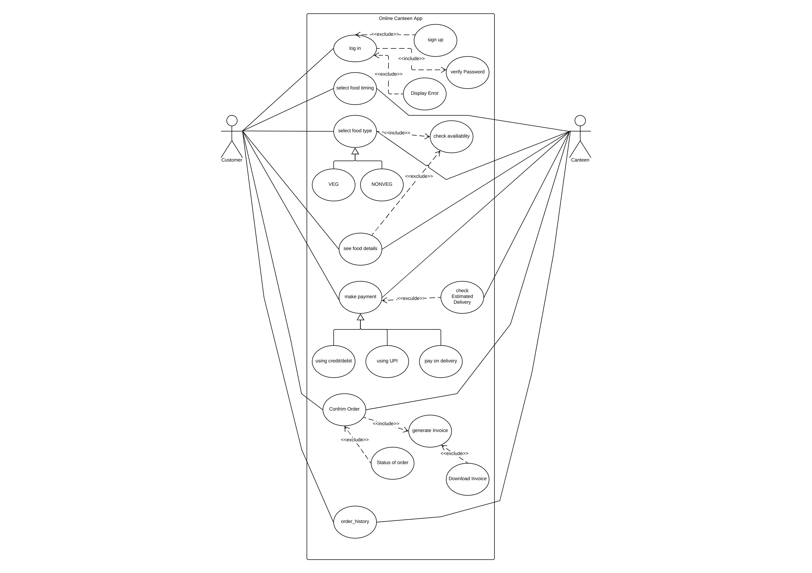
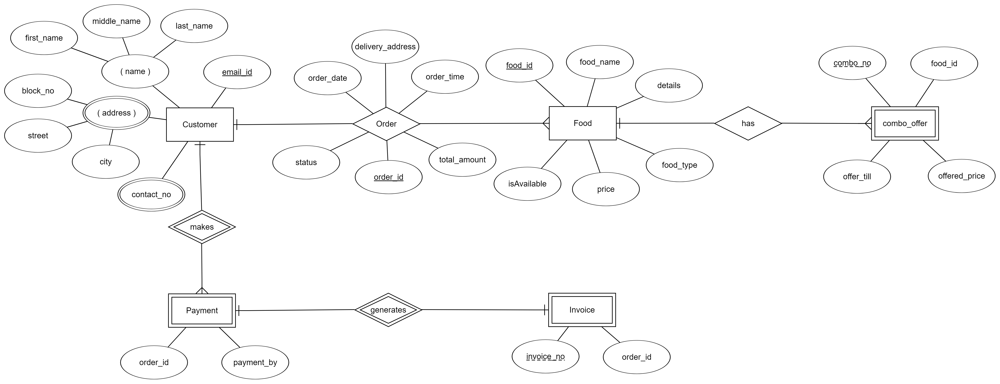

# Online-Canteen-System

It is an Online Canteen System using J2EE. I have used the concepts of JDBC, JSP, Servlet, MVC architecture and Spring. For configurations,
I have used both XML and annotations based configurations. 
There are the Pojo and Dao classes along with jsp and servlet java files in src/main folder.

The Use Cases Diagram of the System is given below:

The ER-diagram of the System is given below:

